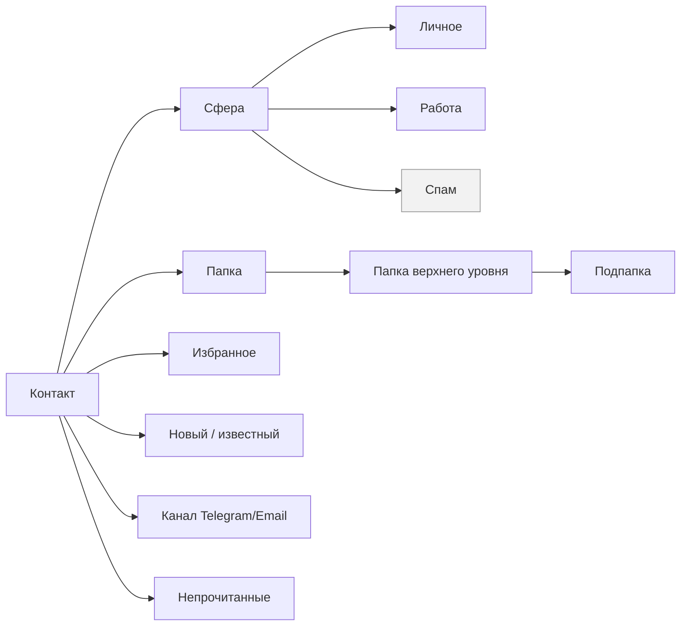
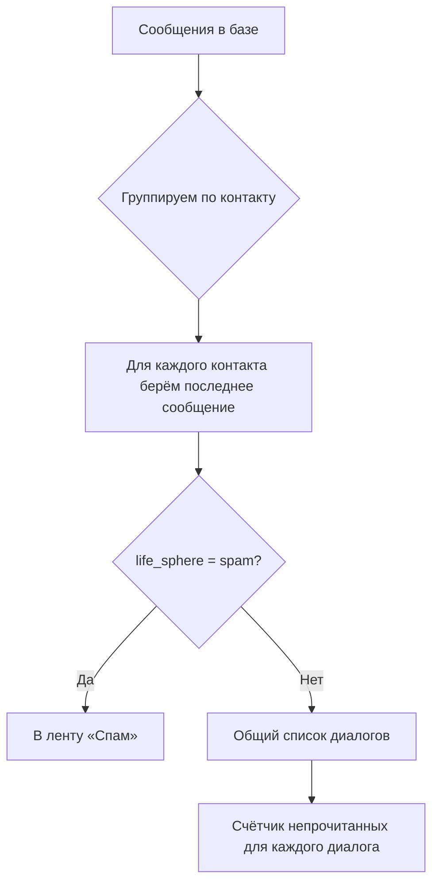
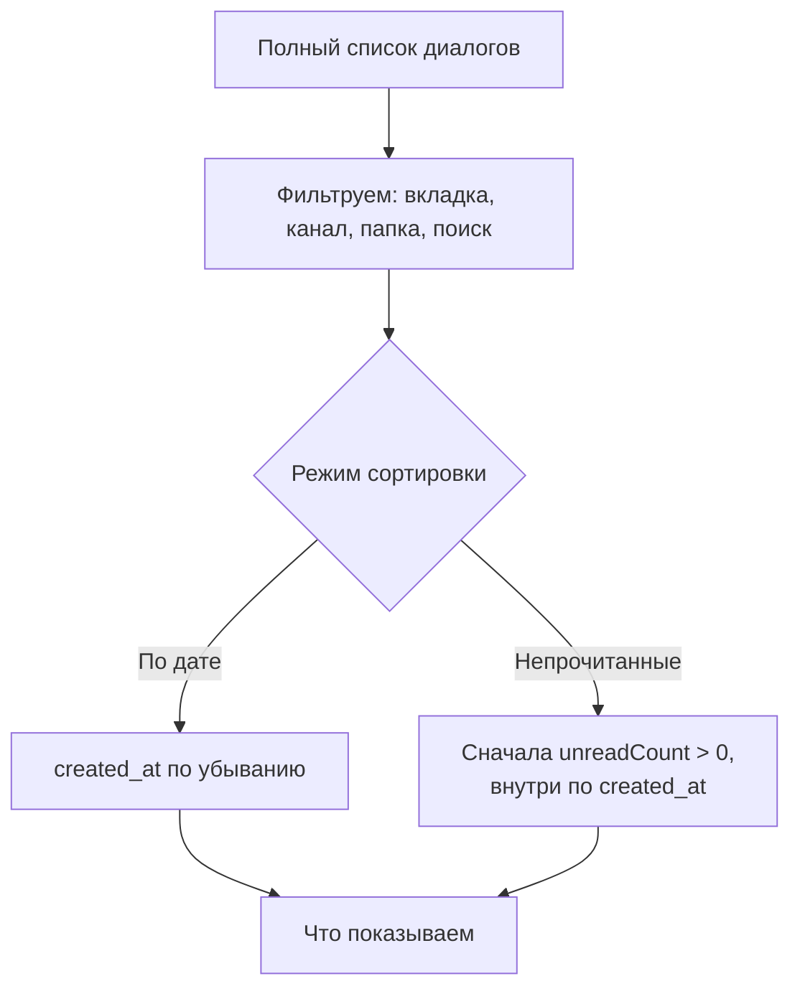
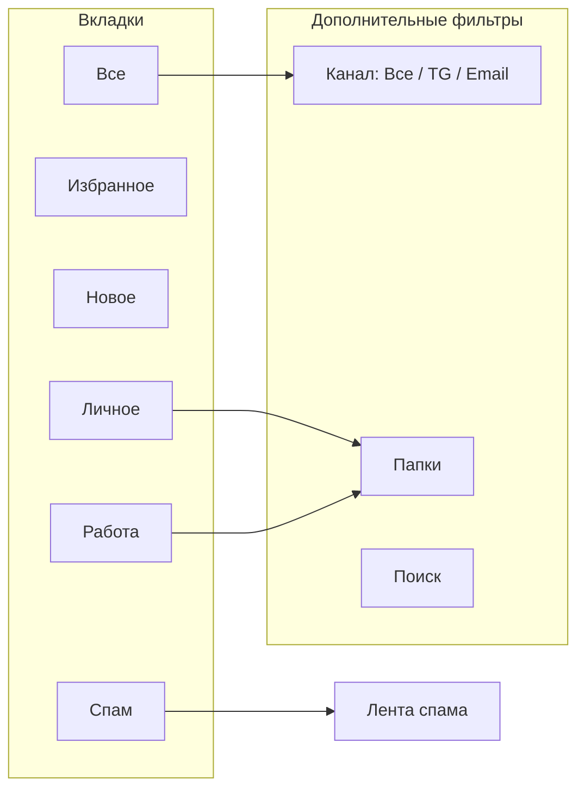
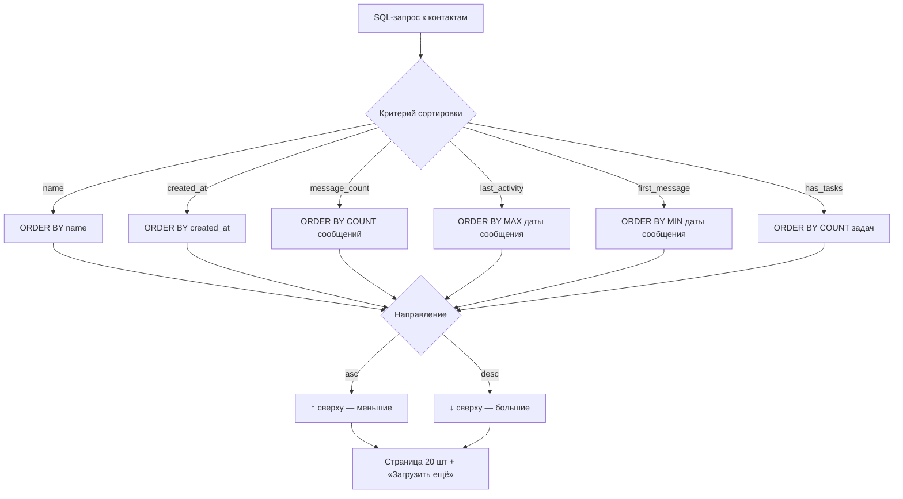
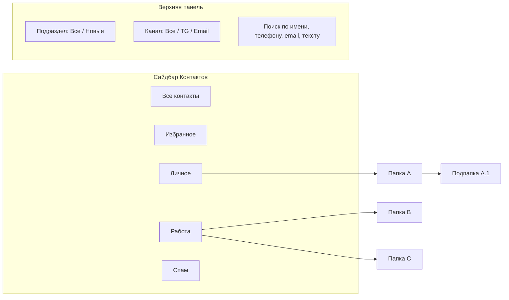
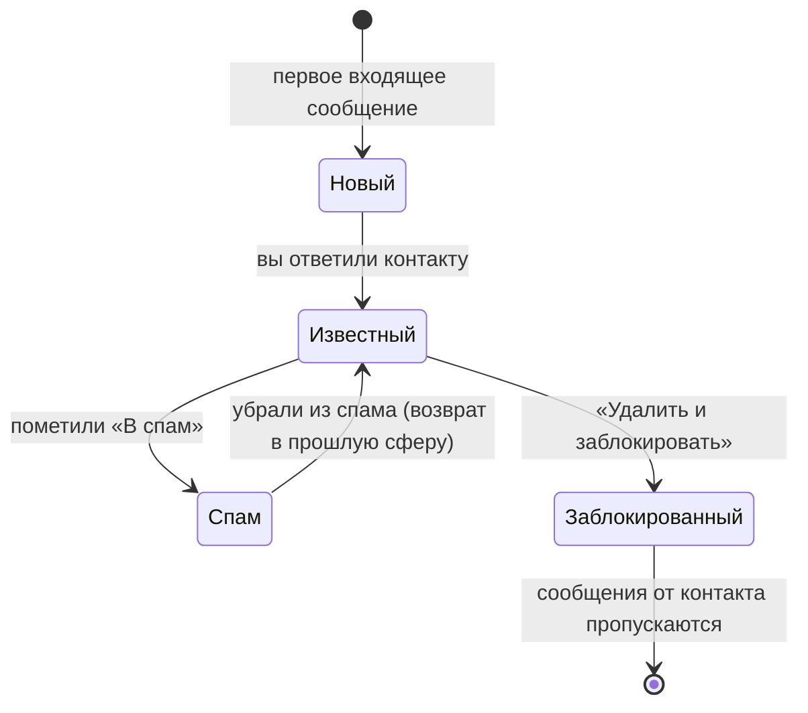

# Контакты и Входящие: сортировка и классификация

Разбор того, как устроены списки в разделах **Входящие** и **Контакты**: какие есть режимы сортировки, как раскладываются контакты по сферам/папкам и как это работает «под капотом».

---

## 1. Базовые термины классификации

Вся система крутится вокруг **контакта**. У каждого контакта есть набор признаков, по которым его можно отсортировать и разложить по полочкам:

| Признак | Что это | Где видно |
|---|---|---|
| **Сфера (life_sphere)** | Главный уровень: `Личное`, `Работа`, `Спам` | Вкладки во Входящих и сайдбар в Контактах |
| **Папка (folder)** | Папки внутри сферы, с подпапками, у каждой свой цвет | Сайдбар в Контактах, фильтр над списком во Входящих |
| **Избранное (is_favorite)** | Звёздочка — важный контакт | Вкладка «Избранное», фильтр в Контактах |
| **Новый (is_known = false)** | Контакт ещё «не подтверждён» | Вкладка «Новое» во Входящих, подраздел «Новые» в Контактах |
| **Канал** | Telegram / Email (или оба) | Фильтры «Все / Telegram / Email» |
| **Непрочитанные** | Есть входящие, на которые не ответили | Бейджи-счётчики, сортировка «Непрочитанные» |

Важно: **сфера и папка связаны жёстко** — папка не может «жить» в чужой сфере. Сервер проверяет это и не даст положить контакт в папку «Работа», если у него сфера «Личное».

---

## 2. Входящие (Inbox)

### 2.1 Как строится список

Список — это **диалоги (threads)**, а не сообщения подряд: на каждого контакта берётся **одно последнее сообщение** + количество непрочитанных. Сервер делает это одним запросом: группирует сообщения по контакту и оставляет самое свежее. По умолчанию список уже упорядочен по дате последнего сообщения.

Спам-контакты в общий список **не попадают вообще** — они видны только во вкладке «Спам».

### 2.2 Сортировка (2 режима)

Переключение — кнопки в верхней панели списка. Сортировка выполняется **на клиенте**, мгновенно, без запроса к серверу.

| Режим | Правило |
|---|---|
| **По дате** | Диалоги от свежих к старым по времени последнего сообщения |
| **Непрочитанные** | Сначала все диалоги с непрочитанными, затем остальные; внутри каждой группы — по дате |

### 2.3 Фильтрация (что показываем)

Кнопка сортировки решает **порядок**, а вкладки и фильтры — **что показывать**:

1. **Вкладки**: Все / Избранное / Новое / Личное / Работа / Спам.
   - «Избранное» — только контакты со звёздочкой.
   - «Новое» — только с непрочитанными.
   - «Личное» / «Работа» — только контакты соответствующей сферы, спам отсекается.
   - «Спам» — открывает отдельную ленту спама.
   - Порядок вкладок можно **перетаскивать**, он сохраняется в браузере.
2. **Фильтр по каналу**: Все / Telegram / Email.
3. **Папки** (во вкладках Личное/Работа) — показывают только контакты этой папки, с цветной точкой и счётчиком.
4. **Поиск** — по имени и по тексту сообщений; при поиске список пересобирается и группируется по контактам.

### 2.4 Массовая классификация из Входящих

В панели над списком можно отметить несколько диалогов галочками и:

- **«Прочитано»** — снять непрочитанные со всех сразу;
- **«Классифицировать…»** — разом разложить выбранные контакты по сферам и папкам (в выпадающем списке дерево: сфера → папка → подпапка).

Это один запрос к серверу, который массово проставляет `life_sphere` и `folder_id`.

---

## 3. Контакты (Contacts)

### 3.1 Сортировка (6 режимов + направление)

Выпадающий список «По имени» + кнопка ↑/↓. Сортировка выполняется **на сервере, в SQL**.

| Режим | Как работает |
|---|---|
| **По имени** | Обычный порядок по имени, по умолчанию А→Я |
| **По дате создания** | Порядок по `created_at` |
| **По сообщениям** | Считается число сообщений на контакт, сортировка по этому числу |
| **По последнему сообщению** | Максимальная дата сообщения; контакты без сообщений — как 1970, всегда внизу |
| **По первому сообщению** | То же самое, но по самой ранней дате |
| **По задачам** | Сортировка по количеству задач у контакта |

Правило при переключении: при выборе **нового** критерия направление по умолчанию «по убыванию» (самые «большие» сверху), исключение — «По имени» (всегда «по возрастанию»). Повторный клик по тому же критерию переворачивает порядок ↑/↓.

Список грузится порциями по 20 контактов, кнопка **«Загрузить ещё»** достраивает список.

### 3.2 Классификация: сайдбар слева

Слева — дерево фильтров, которое одновременно служит способом классифицировать:

- **Все контакты** — без фильтров (спам включается).
- **Избранное** — звёздочки.
- **Сферы**: Личное / Работа / Спам; при выборе сферы раскрываются её папки.
- **Папки и подпапки** — у каждой свой цвет, вложенность отображается отступом.

Прямо из этого окна работает классификация **drag&drop**: берёшь контакт из списка и перетаскиваешь на папку — контакту проставляется папка.

### 3.3 Дополнительные фильтры в шапке

- **Все / Новые** — «Новые» = контакты с `is_known = false`.
- **Канал** — все / Telegram / Email.
- **Поиск** — по имени, телефону, email и даже по тексту сообщений контакта.

Отдельная «вторая ось» классификации — **типы контактов** (шаблоны: личный, рабочий, сервис и т.п.), их можно назначать контакту, но фильтра по ним в текущем UI списка нет.

---

## 4. Автоматическая классификация (без участия человека)

- **Новый контакт**: при первом входящем сообщении создаётся с `is_known = false` — попадает в «Новое». После первого ответа становится «известным» (`is_known = true`).
- **Спам-контакт**: входящие от него **не записываются** в обычный поток — сервер пропускает сообщение. Раздел «Спам» позволяет принудительно загрузить диалог.
- **Перенос в спам и обратно**: при переводе в спам запоминается предыдущая сфера (`previous_life_sphere`). При «разспаме» контакт возвращается в неё, а не остаётся без сферы. Папка при этом сбрасывается.
- **Блокировка**: заблокированный контакт тоже молча пропускается при загрузке новых сообщений.

---

## 5. Разница в двух словах

| | Входящие | Контакты |
|---|---|---|
| Сортировка | 2 режима, на клиенте | 6 режимов + ↑/↓, в SQL на сервере |
| Классификация | Вкладки + каналы + папки + массовая | Сайдбар + drag&drop + типы контактов |
| Спам | Скрыт из общего списка, живёт в «Спам» | Отдельная сфера, не мешается |
| Пагинация | Нет (один запрос) | Да, по 20 с «Загрузить ещё» |